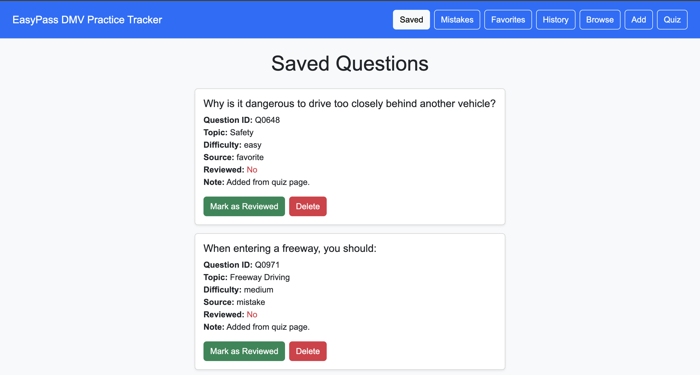
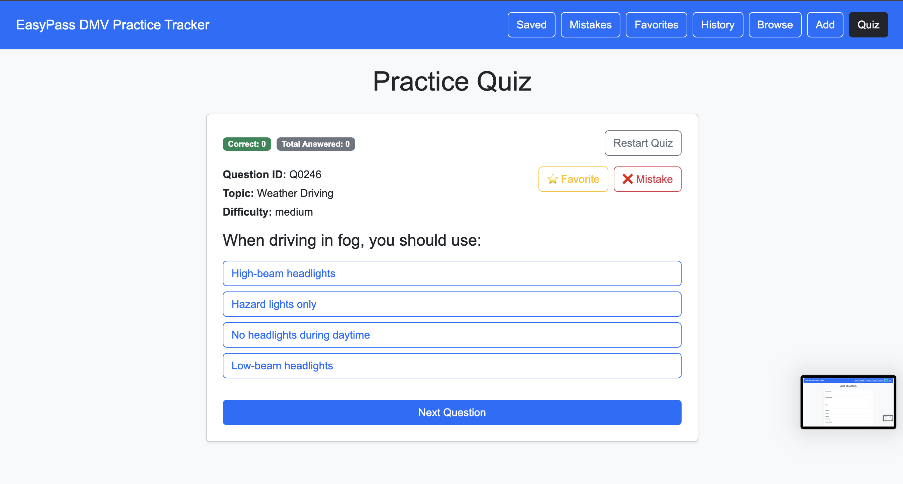
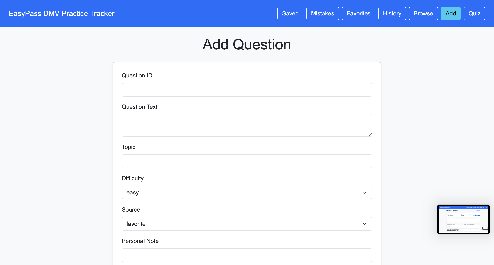
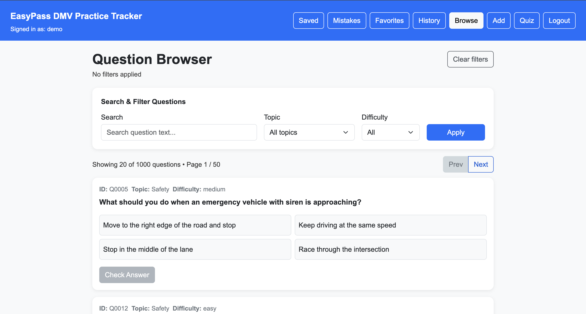
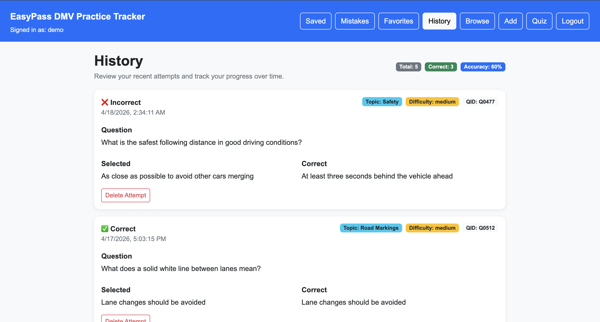
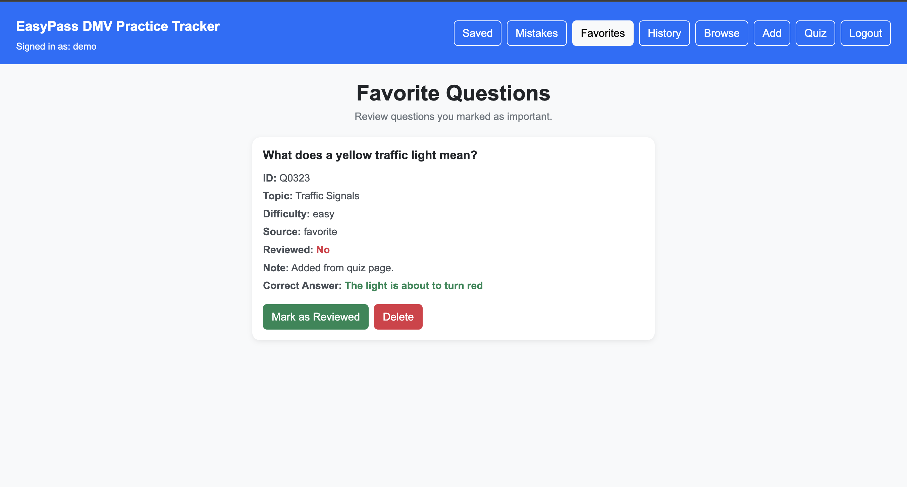
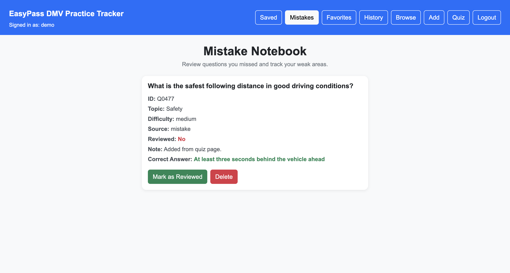

# EasyPass DMV Practice Tracker – Design Document

## Project Description

EasyPass DMV Practice Tracker is a full-stack web application designed to help users prepare for DMV written tests more effectively. Unlike traditional practice apps, EasyPass focuses on tracking user mistakes, reviewing weak areas, and improving long-term retention.

The system provides features such as:

- Browsing and filtering questions
- Taking quizzes and checking answers
- Saving important questions
- Reviewing mistake history
- Tracking progress over time

The frontend is built using React with hooks and client-side rendering (CSR), while the backend uses Node.js with Express and a MongoDB database (native driver).

---

## System Architecture

Client (React - CSR)
↓ fetch API
Server (Node.js + Express)
↓
MongoDB (native driver)

---

## Personas

### Alex – Busy College Student

- Goal: Pass DMV test quickly
- Pain Point: Limited time
- Scenario: Uses short practice sessions daily

### Mei – International Student

- Goal: Understand traffic rules
- Pain Point: Language barrier
- Scenario: Reviews saved and mistake questions

### Jordan – Retake User

- Goal: Pass after failure
- Pain Point: Repeating mistakes
- Scenario: Uses mistake notebook

---

## User Stories

- Users can practice questions quickly
- Users can filter by topic/difficulty
- Users can save questions
- Users can review mistakes
- Users can track history

---

## Design Mockups

The following screenshots represent the actual UI design of the system and serve as the design mockups for this project.

### Saved Questions

### Practice Quiz

### Add Question

### Question Browser

### History

### Favorite Questions

### Mistake Notebook

---

## Wireframes

### Question Browser

- Filters (topic, difficulty, search)
- Question list
- Pagination

### Quiz Page

- Question
- Options
- Check answer button

### Saved Questions

- List of saved questions
- Delete / mark reviewed

### Mistake Notebook

- Only mistake questions
- Mark as reviewed

### History Page

- List of past attempts

---

## Technologies

- Frontend: React (hooks, CSR)
- Backend: Node.js + Express
- Database: MongoDB (native driver)
- Styling: CSS / Bootstrap
- Linting: ESLint + Prettier

---

## Authentication Design

In the final iteration of this project, authentication was added using Passport.js (Local Strategy) to support user accounts and session management.

### Key Features

- Users can register and create an account
- Users can log in and log out securely
- Session-based authentication using express-session
- Session data is stored in MongoDB using connect-mongo (persistent storage)

### Design Decisions

- A simple username/password system was chosen for usability and simplicity
- Session-based authentication was preferred over token-based (JWT) to align with course requirements
- MongoDB-backed sessions ensure scalability compared to in-memory storage

### Impact

- Enables personalized data (favorites, mistakes, history per user)
- Improves realism of the application (closer to production systems)
- Addresses previous feedback where authentication was missing

---

## Conclusion

This system focuses on improving learning efficiency through tracking and reviewing, making it more effective than traditional quiz apps.

---

## Usability Improvements (Iteration)

Based on usability testing and iteration goals, several improvements were made to enhance user experience:

### Navigation Improvements

- Added clear navigation bar with labeled sections
- Highlighted active page for better orientation

### Feedback and Interaction

- Immediate feedback in quiz mode (correct/incorrect)
- Clear visual indicators (colors for correctness)
- Disabled buttons when actions are not allowed

### Layout and Clarity

- Improved spacing and alignment across pages
- Grouped related information (question, metadata, answers)
- Reduced clutter in forms and lists

### Accessibility Enhancements

- Added "Skip to main content" link for keyboard users
- Improved semantic HTML structure
- Ensured buttons use proper `<button>` elements instead of divs

### Result

These changes made the application easier to navigate, reduced confusion, and improved task completion speed for users.

---

## Future Improvements

- Add advanced analytics (progress charts)
- Improve mobile responsiveness
- Add multi-user support with roles
- Enhance UI design with a more consistent visual theme