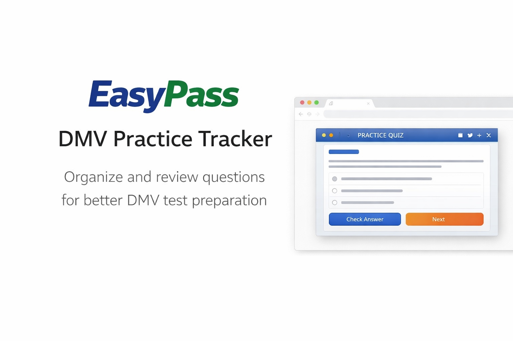
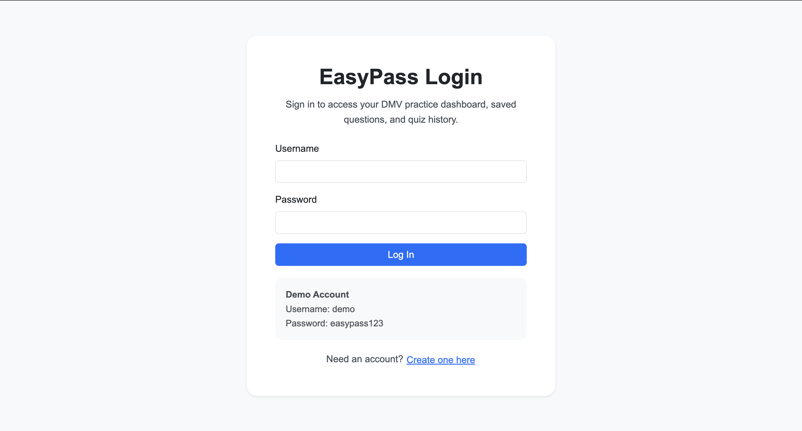
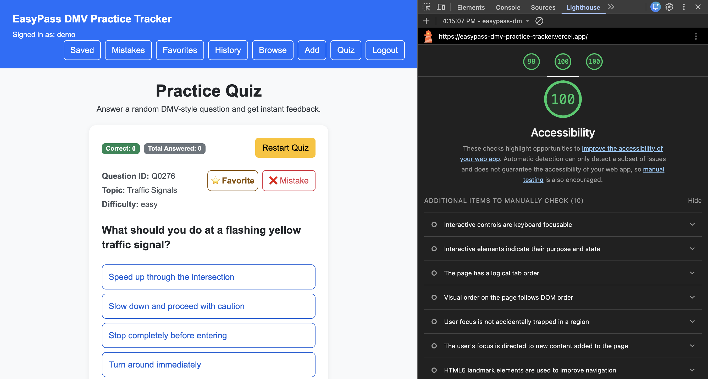

# EasyPass DMV Practice Tracker



**Authors**: Zihan Guo, Fanchao Yu  
**Course**: CS5610 Web Development  
**Project Type**: Full Stack Web Application

---

## Project Overview

EasyPass is a full-stack web application designed to help users prepare for the DMV written test in a structured and efficient way.

Unlike traditional DMV practice tools that focus only on random quizzes, EasyPass provides a **complete learning workflow**, including:

- Practice (Quiz)
- Exploration (Browse with Search & Filter)
- Reflection (Mistake Notebook)
- Progress Tracking (History & Accuracy)

The system emphasizes **immediate feedback, personalized review, and long-term learning**.

---

## Live Demo

Frontend (Vercel):  
https://easypass-dmv-practice-tracker.vercel.app

Backend (Render):  
https://easypass-dmv-practice-tracker.onrender.com

---

## Screenshots

### Login Page

  
Users can log in to access personalized features.

### Quiz Mode

  
Users answer one question at a time with **instant feedback**, simulating the real DMV test experience.

### Question Browser

  
Users can **search and filter questions by topic and difficulty** using the Search & Filter panel.

### Saved Questions

  
Users can review saved questions for later study.

### Favorites Page

  
Users can save important or interesting questions for quick review.

### Mistakes Page

  
Users can revisit incorrectly answered questions and track improvement.

### History Page

  
Users can track performance over time, including accuracy and past attempts.

### Add Question

  
Users can contribute new questions to the system.

### Accessibility (Lighthouse)


---

## Features

- Random DMV-style quiz with **instant feedback**
- Question browser with **Search & Filter (topic + difficulty + keyword)**
- Save questions to Favorites
- Mistake Notebook for targeted review
- Attempt history tracking with accuracy metrics
- Mark questions as reviewed
- Delete attempts and saved questions
- Add new questions to the system

---

## Accessibility

We designed EasyPass with accessibility in mind:

- Full **keyboard navigation support**
  - Tab to navigate between inputs and buttons
  - Enter to select answers and submit actions
- Semantic HTML structure
- Accessible form labels
- Clear visual feedback for actions
- High contrast UI for readability

**Lighthouse Accessibility Score: 100**

---

## Authentication

Authentication is implemented using Passport with session-based login.

Users can:

- Register a new account
- Log in securely
- Maintain session across refresh
- Log out safely

Demo account:

- Username: demo
- Password: easypass123

---

## System Design

### MongoDB Collections

**questions**

- Stores DMV question bank (1000+ synthetic records)
- Read-only collection

**savedQuestions**

- Stores user-saved questions
- Full CRUD support

**attempts**

- Stores quiz attempt history
- Full CRUD support

---

## API Endpoints

### Questions

GET /api/questions  
GET /api/questions/random  
GET /api/questions/meta

### Saved Questions

GET /api/saved-questions  
POST /api/saved-questions  
PUT /api/saved-questions/:id/review  
DELETE /api/saved-questions/:id

### Attempts

GET /api/attempts  
POST /api/attempts  
PUT /api/attempts/:id  
DELETE /api/attempts/:id

---

## Tech Stack

### Frontend

- React (Hooks)
- React Router
- Vite
- Bootstrap
- CSS Modules
- PropTypes

### Backend

- Node.js
- Express

### Database

- MongoDB (native driver)

### Other

- Fetch API (no axios)
- ESLint
- Prettier

---

## Project Structure

```
client/
  src/
    components/
    pages/
    services/

server/
  routes/
  config/
  seedQuestions.js
```

---

## Setup Instructions

### Prerequisites

- Node.js
- MongoDB

---

### Backend Setup

```bash
cd server
npm install
```

Create `.env` file:

```
MONGO_URI="your-mongodb-connection-string"
PORT=4000
```

Run:

```bash
node server.js
```

---

### Seed Database

```bash
cd server
node seedQuestions.js
```

---

### Frontend Setup

```bash
cd client
npm install
npm run dev
```

---

## User Stories

- Practice DMV questions interactively
- Search and filter questions by topic/difficulty
- Save important questions
- Track mistakes for focused review
- Monitor progress through history and accuracy

---

## Usability Highlights

- Instant feedback in Quiz improves learning efficiency
- Search & Filter enables targeted practice
- History page helps track readiness for the test
- Mistake Notebook supports repeated learning

---

## Course Link

https://neu-seattle.github.io/cs5610/

---

## License

MIT License
